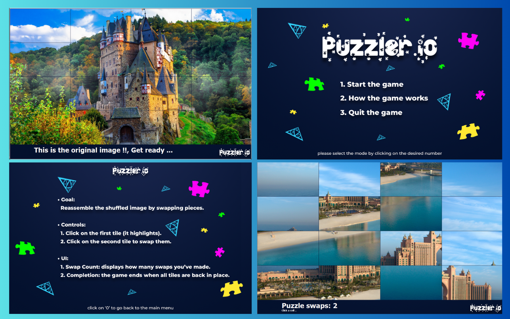
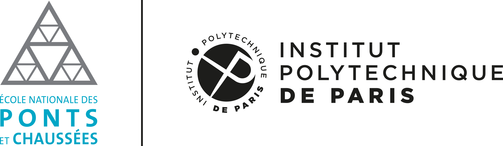

# Puzzler - Puzzle Imagine++

## Description

Ce projet est un jeu de puzzle en C++ utilisant la librairie Imagine++. Le jeu propose au joueur de résoudre un puzzle en réassemblant une image divisée en carrés mélangés. Des fonctionnalités telles que des contraintes de temps, un système de meilleur score et un classement des joueurs sont prévues.

## Capture d'écran - Puzzler.io



## Fonctionnalités Principales (Planifiées)

* **Sélection d'image :** Possibilité de choisir une image parmi un ensemble prédéfini (ou potentiellement d'en charger une).
* **Subdivision :** L'image sélectionnée est divisée en une grille de carrés (la taille de la grille sera peut-être configurable).
* **Mélange des pièces :** Les carrés sont mélangés de manière aléatoire.
* **Interaction utilisateur :** Le joueur peut échanger la position de deux carrés adjacents (ou par glisser-déposer).
* **Résolution :** Le jeu détecte automatiquement lorsque l'image est correctement réassemblée.
* **Nombre de swaps :** Enregistrement du nombres de swaps pour chaque puzzle complété.

## Prérequis

* Un compilateur C++ (par exemple, g++ ou gcc).
* La librairie Imagine++ installée. Les instructions d'installation peuvent être trouvées sur le site officiel : [https://imagine.enpc.fr/~monasse/Imagine++/](https://imagine.enpc.fr/~monasse/Imagine++/)
* CMake (pour la gestion du build, recommandé).

## Installation et Compilation

1.  **Cloner le dépôt GitHub :**
    ```bash
    git clone VOTRE_URL_DE_DEPOT
    cd VOTRE_PROJET_PUZZLE
    ```

2.  **Créer un répertoire de build :**
    ```bash
    mkdir build
    cd build
    ```

3.  **Configurer le projet avec CMake :**
    ```bash
    cmake ..
    ```
    (Assurez-vous que CMake trouve bien votre installation d'Imagine++ . Vous devrez peut-être spécifier le chemin d'installation si ce n'est pas le chemin par défaut).

4.  **Compiler le projet :**
    ```bash
    make
    ```

5.  **Exécuter le jeu :**
    ```bash
    ./puzzle
    ```

## Structure du Projet (Proposition Initiale)
```
.
├── .gitignore
├── .vscode/
├── CMakeLists.txt
├── LICENSE
├── build/
├── Media/
│   ├── image1.jpg
│   ├── image2.jpg
│   ├── image3.jpg
│   ├── image4.jpg
│   ├── image5.jpg
│   ├── image7.jpg
│   ├── image8.jpg
│   └── image9.jpg
├── Puzzle.cpp
├── Puzzle.h
├── PuzzlePiece.cpp
├── PuzzlePiece.h
├── README.md
└── main.cpp
```


## Contribution
### Binôme fondateur de projet
- Anwar Kardid
- AbdelAdim Boudersa 

#### Ecole: (ENPC) École nationale des ponts et chaussées.



